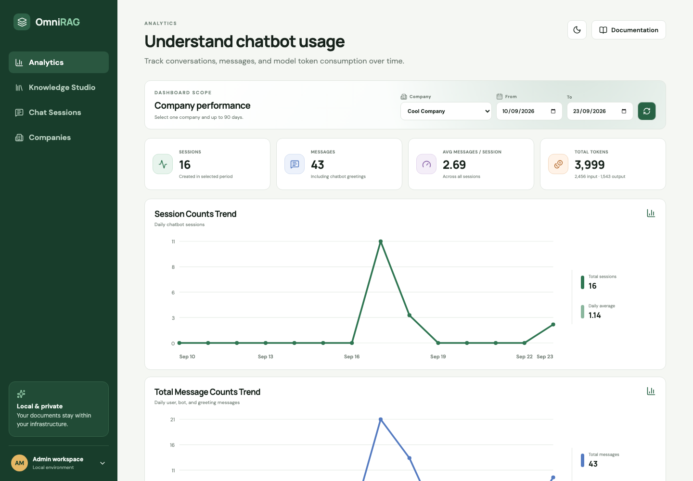
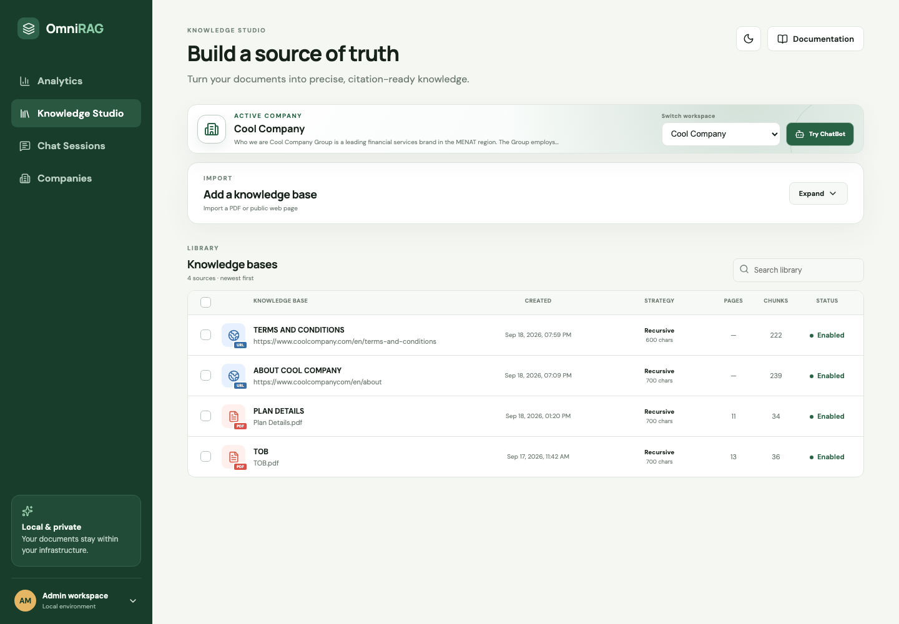
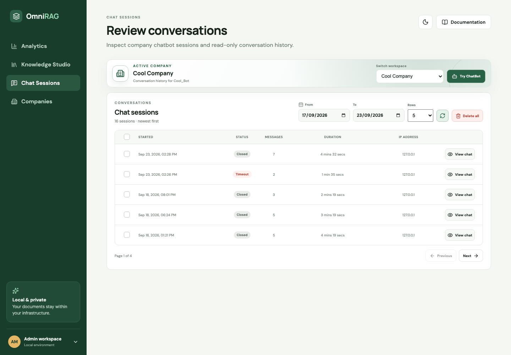
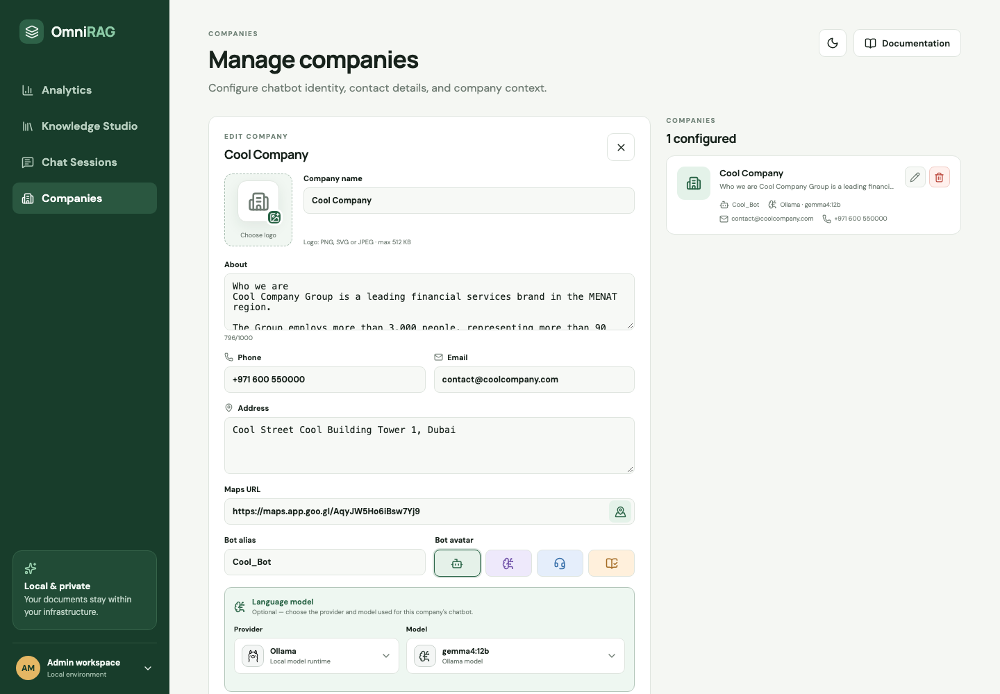
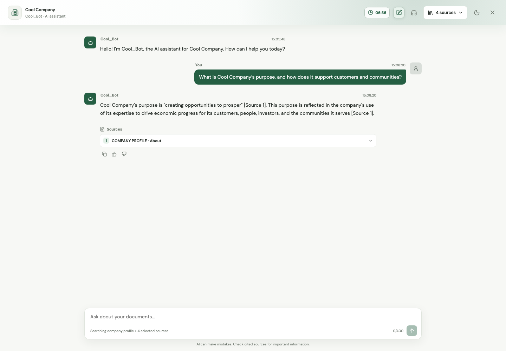
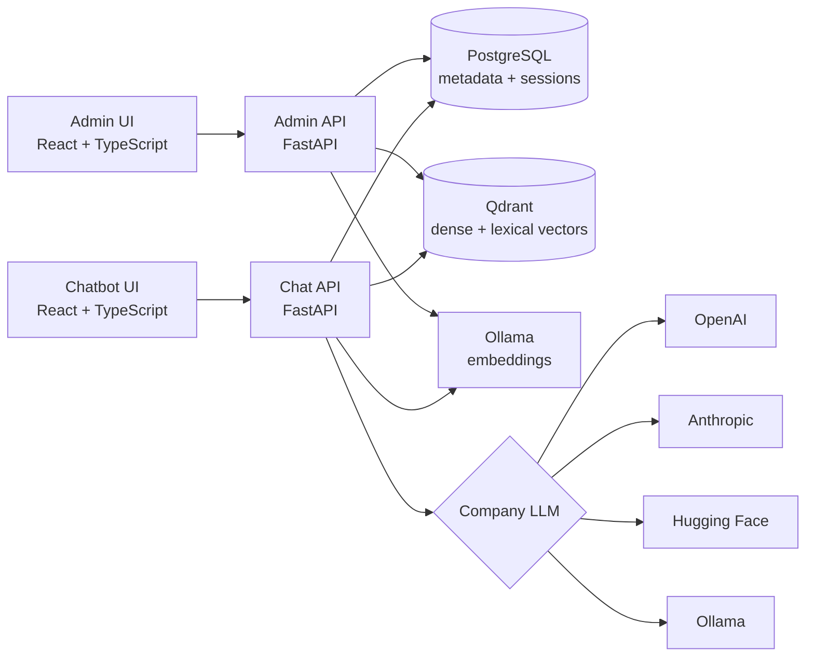

<div align="center">

# Omni RAG Chat

### Build company-specific AI assistants from PDFs, web pages, and structured business context.

Omni RAG Chat is a local-first, multi-company RAG platform with knowledge ingestion,
hybrid retrieval, cited answers, configurable LLM providers, durable chat sessions, and
usage analytics.

[](https://www.python.org/)
[](https://fastapi.tiangolo.com/)
[](https://react.dev/)
[](https://www.postgresql.org/)
[](https://qdrant.tech/)
[](https://docs.astral.sh/uv/)
[](LICENSE)

Open source under the [Apache License 2.0](LICENSE).

</div>

## Product tour

### Admin workspace

Manage companies, configure language models, ingest PDF or URL knowledge, review chat
sessions, and monitor daily usage from one workspace.

#### Analytics

Track sessions, messages, and input/output token consumption for the selected company.



#### Knowledge Studio

Manage the selected company's PDF and web knowledge sources, indexing strategies, and
availability.



#### Chat Sessions

Filter, inspect, paginate, and manage the selected company's conversation history.



#### Company configuration

Edit company identity, contact details, bot appearance, greeting template, and language
model settings.



### Customer chatbot

A company-branded, session-aware chat experience with streaming responses, citations,
source selection, lifecycle controls, and human escalation.



## What the platform does

| Capability | Details |
|---|---|
| Multi-company workspaces | Isolates company profiles, branding, LLM settings, knowledge bases, chat sessions, and analytics by stable company ID. |
| PDF knowledge ingestion | Previews pages, supports inclusion or exclusion ranges, fingerprints file content, and rejects duplicate imports. |
| Web knowledge ingestion | Safely fetches one public HTML page, strips page chrome, preserves headings, and refreshes changed content from the same URL. |
| Flexible chunking | Fixed-size, Recursive, Semantic, and Hierarchical strategies for PDFs; structure-aware Recursive and Hierarchical strategies for URLs. |
| Hybrid retrieval | Combines dense semantic and sparse lexical candidates with reciprocal-rank fusion in Qdrant. |
| Grounded chat | Streams answers constrained to retrieved context and returns only sources actually cited in the answer. |
| Provider choice per company | Supports OpenAI, Anthropic, Hugging Face Inference Providers, and local Ollama with per-company encrypted API keys. |
| Durable session lifecycle | Persists greetings, user/bot messages, IP address, status, timestamps, hard expiry, and browser-tab closure. |
| Usage analytics | Tracks sessions, messages, average messages per session, and provider-reported input/output tokens with daily trends. |

## Architecture



The Admin and Chat APIs share PostgreSQL and Qdrant while remaining independently
deployable. PostgreSQL is the system of record. Qdrant payloads contain stable IDs and
retrieval metadata, while display names and source details are resolved from PostgreSQL.

## Technology stack

| Layer | Technologies |
|---|---|
| Admin and Chat UIs | React 19, TypeScript, Vite, Lucide icons, custom responsive CSS |
| APIs | Python 3.11+, FastAPI, Pydantic Settings, Uvicorn |
| Persistence | PostgreSQL 18+, SQLAlchemy 2, Psycopg 3 |
| Vector retrieval | Qdrant dense vectors, lexical scoring, reciprocal-rank fusion |
| Document processing | PyPDF, HTML extraction, SHA-256 content fingerprints |
| AI integration | Ollama embeddings; OpenAI, Anthropic, Hugging Face, or Ollama generation |
| Security | Fernet-encrypted per-company API keys, SSRF-safe URL fetching, sanitized SVG uploads |
| Tooling | uv, npm workspaces, Pytest, Ruff, Vitest, Docker Compose, Nginx |

## Repository layout

```text
omni-rag-chat/
├── admin-be/                   # Company, knowledge, session, and analytics API
├── admin-ui/                   # Administration workspace
├── chatbot-be/                 # Session-scoped retrieval and chat API
├── chatbot-ui/                 # Customer-facing chatbot
├── packages/omni_rag_core/     # Shared domain, repository, RAG, and provider clients
├── tests/                      # Backend and shared-domain tests
├── docs/                       # Architecture notes and product screenshots
├── docker-compose.yml
├── pyproject.toml
└── uv.lock
```

## Supported answer providers

Model catalogs are comma-separated environment settings, so deployments can change the
available choices without rebuilding either UI. New companies remain unconfigured until
an administrator selects a provider and model.

| Provider | Default catalog in `.env.example` | API key |
|---|---|---|
| OpenAI | `gpt-5.6-luna`, `gpt-5.6-terra`, `gpt-5.6-sol` | Required per company |
| Anthropic | `claude-haiku-4-5-20251001`, `claude-sonnet-5`, `claude-opus-5` | Required per company |
| Hugging Face | `Qwen3.8-27B`, `DeepSeek-R1`, `DeepSeek-V4.1-Flash`, `gemma4-31B` | Required per company |
| Ollama | `gemma4:12b` | Not required |

Retrieval embeddings use the platform-wide `EMBEDDING_MODEL` independently of the answer
provider. Changing a company's answer model therefore does not require re-indexing its
knowledge.

## How knowledge becomes an answer

1. An administrator creates a company profile and optionally configures its LLM provider.
2. Text company metadata is embedded as individually labeled company-profile chunks.
3. The administrator previews a PDF or public URL, chooses content, and configures chunking.
4. The API fingerprints, chunks, embeds, and stores the source with company-scoped IDs.
5. Admin UI creates a server-side chat session before opening the chatbot.
6. Chat API resolves the company exclusively from `session_id` and retrieves only enabled,
   company-owned sources.
7. Dense and lexical candidates are fused, then sent to the company's configured model with
   citation rules and recent conversation history.
8. The answer, cited sources, message timestamps, and token usage are persisted and returned.

## Quick start with Docker

### Prerequisites

- Docker with Compose
- Ollama reachable from the containers
- The configured embedding model, `nomic-embed-text` by default
- `gemma4:12b` only when a company uses Ollama for answer generation

```bash
cp .env.example .env
ollama pull nomic-embed-text
ollama pull gemma4:12b
docker compose up --build
```

| Service | URL |
|---|---|
| Admin UI | http://localhost:5173 |
| Admin API docs | http://localhost:8001/docs |
| Chatbot UI | `http://localhost:5174/?session_id={session-id}` |
| Chat API docs | http://localhost:8002/chat |
| Qdrant dashboard | http://localhost:6333/dashboard |

Admin UI's **Try ChatBot** action creates a session and opens the correct session-specific
chat URL automatically.

> On Linux, add `extra_hosts: ["host.docker.internal:host-gateway"]` to the API services if
> the host alias is unavailable.

To run only infrastructure:

```bash
docker compose up postgres qdrant
```

## Local development

Install Python 3.11+, [uv](https://docs.astral.sh/uv/), and Node.js 20+.

```bash
cp .env.example .env
uv sync
npm install
```

Run the four applications in separate terminals from the repository root:

```bash
uv run uvicorn admin-be.app:app --reload --port 8001
uv run uvicorn chatbot-be.app:app --reload --port 8002
npm run dev:admin
npm run dev:chat
```

When `.env` is absent, the Python defaults use SQLite. Qdrant and Ollama clients include
development fallbacks, but durable retrieval shared between both API processes requires the
real Qdrant service.

## Configuration

Copy `.env.example` and adjust values for the target environment. Do not commit `.env`.

### Core services

| Variable | Purpose | Default |
|---|---|---|
| `DATABASE_URL` | SQLAlchemy PostgreSQL connection | Local PostgreSQL URL |
| `QDRANT_URL` | Qdrant REST endpoint | `http://localhost:6333` |
| `QDRANT_COLLECTION` | Shared vector collection | `knowledge_chunks` |
| `OLLAMA_URL` | Ollama API endpoint | `http://localhost:11434` |
| `EMBEDDING_MODEL` | Platform-wide retrieval embedding model | `nomic-embed-text` |
| `UPLOAD_DIR` | Temporary PDF upload directory | `.data/uploads` |
| `CORS_ORIGINS` | Comma-separated allowed browser origins | Admin and Chat UI origins |

### LLM providers and secrets

| Variable | Purpose |
|---|---|
| `LLM_CREDENTIALS_KEY` | Stable Fernet key used to encrypt per-company provider credentials |
| `OPENAI_API_URL`, `OPENAI_MODELS` | OpenAI-compatible endpoint and model catalog |
| `ANTHROPIC_API_URL`, `ANTHROPIC_MODELS` | Anthropic endpoint and model catalog |
| `HUGGINGFACE_API_URL`, `HUGGINGFACE_MODELS` | Hugging Face router and model catalog |
| `OLLAMA_MODELS` | Models offered for local answer generation |

Generate the encryption key once and retain it as a deployment secret:

```bash
uv run python -c "from cryptography.fernet import Fernet; print(Fernet.generate_key().decode())"
```

Changing or losing this key makes stored remote-provider credentials unreadable. Complete
API keys are never returned to the browser; Admin UI receives only a masked preview.

### Chat and web ingestion

| Variable | Purpose | Default |
|---|---|---|
| `CHAT_SESSION_MINUTES` | Authoritative maximum session lifetime | `10` |
| `CHAT_SESSION_SWEEP_SECONDS` | Expired-session sweep interval | `5` |
| `VITE_CHAT_IDLE_SECONDS` | Delay before the UI's keep-session prompt | `60` |
| `WEB_FETCH_TIMEOUT` | URL fetch timeout in seconds | `15` |
| `WEB_FETCH_MAX_BYTES` | Maximum downloaded HTML bytes | `5242880` |
| `WEB_FETCH_MAX_REDIRECTS` | Maximum validated redirects | `5` |

## Data and safety guarantees

- Company names preserve submitted casing and are unique without regard to case.
- Knowledge-base names are normalized to uppercase and unique within each company.
- SHA-256 checksums prevent duplicate document content within a company.
- Changed content at an existing URL atomically replaces the old record and vector scope.
- URL imports reject credentials, private/loopback/link-local addresses, unsafe redirects,
  oversized responses, and non-HTML content.
- Company logos are stored in PostgreSQL and limited to PNG, JPEG, or sanitized SVG up to
  512 KB.
- Disabled knowledge bases remain stored but are excluded from source lists and retrieval.
- Qdrant stores IDs instead of company or knowledge-base names.
- Session-sensitive APIs reject unknown, closed, timed-out, and server-expired sessions.
- Deleting a company removes its PostgreSQL records and company-scoped Qdrant points.

## API summary

<details>
<summary><strong>Admin API</strong></summary>

| Method | Endpoint | Purpose |
|---|---|---|
| `GET/POST` | `/api/v1/companies` | List or create companies |
| `PUT/DELETE` | `/api/v1/companies/{id}` | Update or permanently delete a company |
| `GET/PUT/DELETE` | `/api/v1/companies/{id}/logo` | Read, upload, or remove company-logo bytes |
| `GET` | `/api/v1/llm-options` | Return environment-configured provider/model catalogs |
| `POST` | `/api/v1/documents/preview` | Validate and preview a PDF |
| `POST` | `/api/v1/urls/preview` | Safely fetch and preview a public HTML page |
| `GET/POST` | `/api/v1/knowledge-bases` | List or import company knowledge bases |
| `PATCH/DELETE` | `/api/v1/knowledge-bases/{id}` | Enable, disable, or permanently delete a source |
| `GET` | `/api/v1/chat-sessions` | List company sessions with server-side pagination |
| `GET` | `/api/v1/chat-sessions/{id}` | Return a read-only session transcript |
| `DELETE` | `/api/v1/chat-sessions` | Delete selected or date-filtered sessions |
| `GET` | `/api/v1/analytics` | Return company KPIs and zero-filled daily trends |

</details>

<details>
<summary><strong>Chat API</strong></summary>

| Method | Endpoint | Purpose |
|---|---|---|
| `POST` | `/api/v1/chat-sessions` | Create a session and persist its rendered greeting |
| `GET/PATCH` | `/api/v1/chat-sessions/{id}` | Load or finish a session |
| `POST` | `/api/v1/chat-sessions/{id}/close` | Idempotent browser-unload close operation |
| `GET` | `/api/v1/knowledge-bases?session_id={id}` | List enabled sources for the session's company |
| `POST` | `/api/v1/chat` | Return one complete grounded answer |
| `POST` | `/api/v1/chat/stream` | Stream answer tokens, cited sources, and completion |
| `POST` | `/api/v1/escalations` | Request human-support escalation |

</details>

## Quality checks

```bash
uv run ruff check admin-be chatbot-be packages tests
uv run pytest
npm run test:ui
npm run build
```

Pytest enforces at least 90% branch-aware coverage. API tests use temporary SQLite databases
and do not require live PostgreSQL, Qdrant, Ollama, or remote model providers.

## Troubleshooting

| Symptom | Check |
|---|---|
| No companies appear in chat | Confirm both APIs use the same `DATABASE_URL`. |
| No document sources appear | Confirm both APIs share PostgreSQL and `QDRANT_COLLECTION`, and that the source is enabled. |
| Model unavailable response | Verify the company's provider/model mapping, encrypted API key, provider URL, and `LLM_CREDENTIALS_KEY`. For Ollama, check `ollama list`. |
| PDF pages are empty | The PDF is likely image-only; apply OCR before ingestion. |
| URL import is rejected | Confirm the URL is public, server-rendered HTML and fits the configured redirect, size, and timeout limits. |
| Browser reports CORS | Add the UI origin to `CORS_ORIGINS` and restart both APIs. |
| Company save returns `503` | Restore Qdrant connectivity; strict company-metadata synchronization intentionally retains the old PostgreSQL record on failure. |
| Analytics show zero tokens | Historical messages are backfilled with zero; new bot responses use provider-reported usage metadata. |

## More documentation

See [implementation notes](docs/implementation.md) for database behavior, vector payloads,
chunking semantics, session lifecycle, retrieval flow, resilience boundaries, and production
hardening recommendations.
